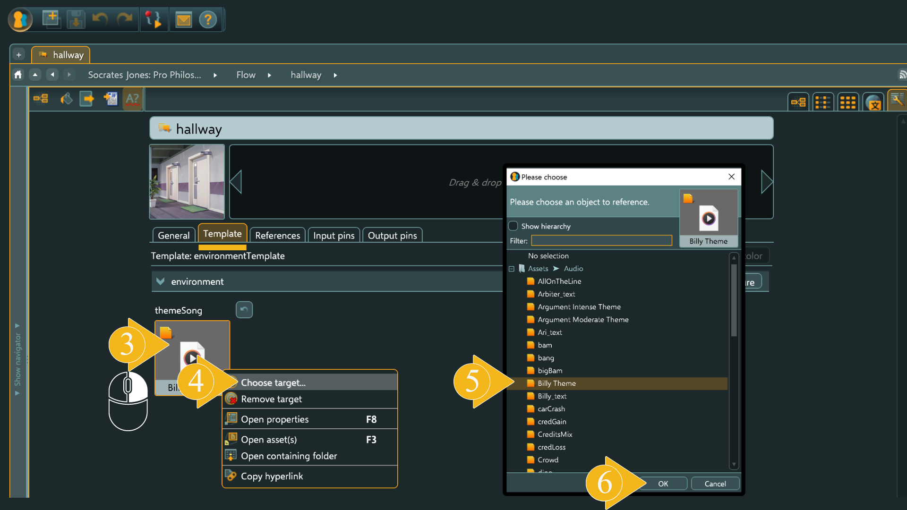
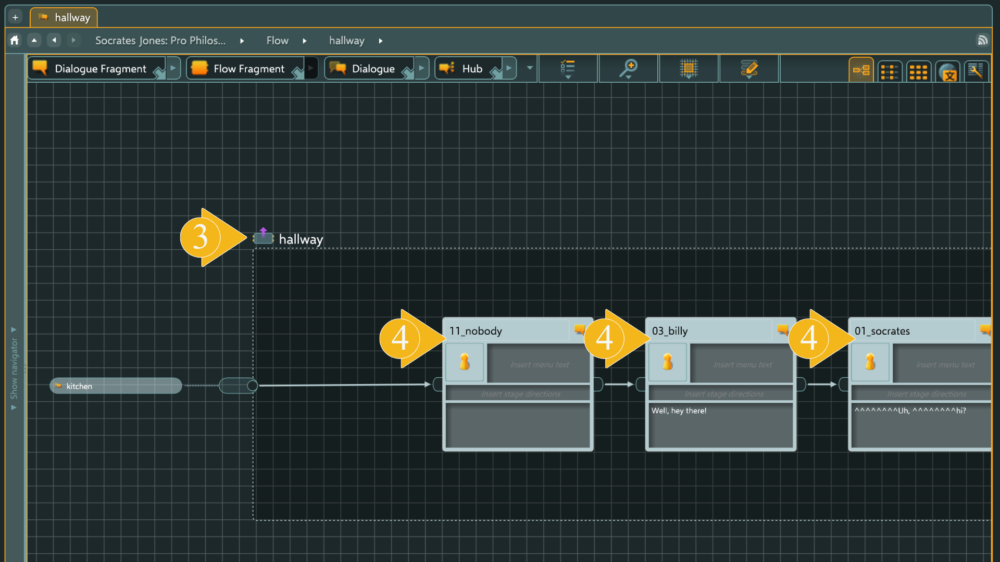
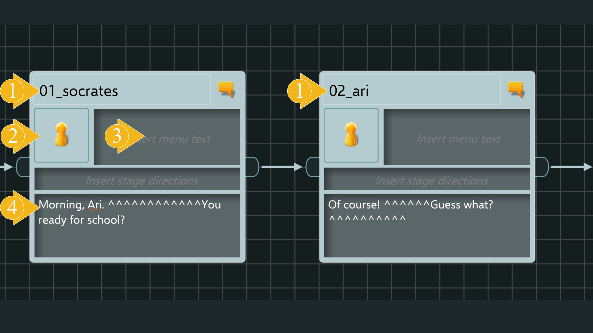
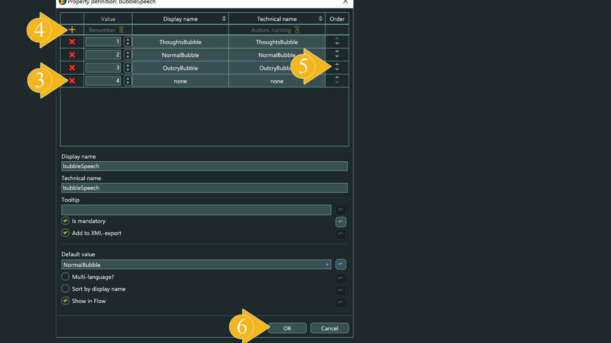

# **Object Dialogue**

[*Method Descriptions for Handlings*](https://github.com/dapp-craft/dcl-novel-engine/blob/engine-only/docs/engine-objects/interfaces/i-sequence.md)

[*Detailed Object Description via Link*](https://www.articy.com/help/adx/Flow_Dialog.html)

A dialogue acts similarly to a folder for grouping character lines. However, this "folder" also offers a number of functions that allow you to create a dialogue scene with additional effects. The screenshot below shows several Dialogues.

In the game, dialogues are used for several tasks:

1.  [*Adding a background to the dialogue*](#adding-a-background-to-the-dialogue)

2.  [*Adding a sound theme to the dialogue*](#adding-a-sound-theme-to-the-dialogue)

3.  [*Connecting fragments of dialogues (character lines) into a separate dialogue*](#grouping-dialogue-fragment-within-the-dialogue-object)

4.  [*Connecting a chain of dialogues into a story*](#building-the-story-flow-from-a-chain-of-dialogues)

***

## **Adding a Background to the Dialogue**

## 

The added background will appear in your scene directly in the dialogue to which it was added. If you need the same background to be used in all dialogues, you will need to add it to each dialogue. If you need to use different backgrounds to symbolize different locations of the dialogue, add the corresponding backgrounds to the dialogues.

1.  To add a background to the dialogue, right-click in the special slot.

2.  In the opened menu, select the "Choose target" option.

3.  A folder with all available images loaded into the "Assets" section will open. Choose the background you need.

4.  Click the "OK" button.

[*Instructions on how to add assets to the "Assets" section*](#object-asset)

***

### 

## **Adding a Sound Theme to the Dialogue**

**themeSong**

[*IAudioAsset interface*](https://github.com/dapp-craft/dcl-novel-engine/blob/engine-only/docs/engine-objects/interfaces/i-audio.md)

The added sound theme will loop throughout the entire dialogue in which it is added. This can be background music or ambient sound characteristic of a location where the action of your game is happening. If you need the same sound theme to be used in all dialogues, you will need to add this file to each dialogue. If you need to use different sound themes to symbolize different locations of the dialogue, add the corresponding sound files to the dialogues.

1.  Select the desired dialogue and right-click to open the context menu.

2.  In the menu, select the "Open Properties" option. This option can also be found in the upper menu in the left corner or by pressing the F8 key.

3.  In the opened "Properties" window of the dialogue, on the "Template" tab, right-click on the special slot for themeSong.

4.  In the opened menu, select the "Choose target" option.

5.  Choose the sound you want to set as the sound theme for this dialogue.

6.  Confirm your choice by clicking the "OK" button.

[*Instructions on how to add sounds to the "Assets" folder*](#object-asset)

***

## **Grouping "Dialogue Fragment" within the "Dialogue" Object**

To view the character lines "Dialogue Fragments", you need to open the contents of the "Dialogue" object. There are several ways to do this:

1.  Select the "Dialogue" Object:  
    First, select the "Dialogue" you wish to open by right-clicking on the object itself. The selected object will have an orange outline.

2.  Open the "Dialogue" Object. There are several ways to open the object:
    -   Button in the Upper Left Corner: Click the button in the upper left corner of the workspace.
    -   Context Menu Item: Select the appropriate option from the context menu.
    -   Double Down Arrow: Click the double down arrow icon located in the upper right part of the "Dialogue" object.

3.  Exit Viewing Contents:  
    To exit the contents view, click the special button located next to the name of the viewed dialogue.

4.  Child Nodes "Dialogue Fragment":  
    The child nodes which are "Dialogue Fragment" objects are most often used for character lines.  
    [*For more information about the "Dialogue Fragment" object, refer to this link*](#object-dialogue-fragment).

***

## **Building the Story Flow from a Chain of Dialogues**

The illustration below shows what a "Dialogue" looks like from the outside and the inside.

The large green arrow symbolizes the narrative direction.

The content of the "Dialogue" object consists of "Dialogue Fragment" objects that are sequentially connected by arrows.

1.  Pay particular attention to the object on the left of our "Dialogue"; this is the previous "Dialogue".

2.  On the right is the next "Dialogue".

To navigate between dialogues, it's not necessary to exit to the outer “Flow”. While inside a Dialogue, simply click on the thumbnails to open the neighboring Dialogue.

Take note of the chain of "Dialogue Fragment" objects located inside. They are all connected by arrows, starting from the incoming pin and ending with the outgoing pin.

"Pin" is the connection point where objects are linked by arrows. It is crucial that all dialogue fragments and dialogues are connected in a chain.

1.  Correct Connection: The incoming pin is connected to the chain of dialogue fragments and finally, the chain is connected to the outgoing pin of the dialogue.

2.  Incorrect Connection: The incoming pin is not connected to the chain of dialogue fragments, and this fragment of game logic will not work.

3.  Incorrect Connection: The outgoing pin is not connected to the chain of dialogue fragments, and this fragment of game logic will not work.

4.  Incorrect Connection: There is a break in the chain of dialogue fragments, and this will also cause a disruption in the game logic.

***

# **Object Dialogue Fragment**

[*Method Descriptions for Handling*](https://github.com/dapp-craft/dcl-novel-engine/blob/engine-only/docs/engine-objects/interfaces/i-frame.md)

[*Detailed Object Description via Link*](https://www.articy.com/help/adx/Flow_Objects_DialogFragment.html)

These objects are most commonly used for character lines.

1.  Character Lines Example: The illustration below shows a dialogue fragment between two characters, Socrates and Ari. The character's name is indicated at the top of the object. ([*More about characters via the link*](#object-entities))

2.  Character Slot: This is the slot where you can select the character who will own the line recorded in this object. If you add images for each character in the "Entities" section, a thumbnail of this image will appear in this slot, making it easier to identify the speaker.

3.  Branching Option Field: This field is used only when you need to create a branching option that allows the player to make a choice. In this case, the text string entered in this field will be displayed on the button with the options for the player.

4.  Text Input Field: This field is used to enter the character's line or informational notification that will be shown in a speech bubble during the game. The screenshot below shows a fragment of this dialogue in the game.

***

### 

## **Properties of the Dialogue Fragment Object**

In this material, we will focus on the "Templates" tab as it contains a pre-created template which we will review.

This template includes several types of objects that you will interact with most frequently:

1.  [*characterInFrame\_*](#characterinframe_)

2.  [*node*](#node)

### **characterInFrame\_**

[*Method Descriptions for Handling*](https://github.com/dapp-craft/dcl-novel-engine/blob/engine-only/docs/engine-objects/interfaces/i-frame-character.md)

On the screenshot below, you can see this object with the value `01` (characterInFrame_01) and several other collapsed objects with the same names but different values:

-   `characterInFrame_02`

-   `characterInFrame_03`

-   `characterInFrame_04`

-   `…`

Inside, all these objects look exactly the same as `characterInFrame_01`, so the description will be based on this example.

The `characterInFrame\_` object is used to manage the character's presence and actions in the scene. This includes:

##### 

#### **name**

By clicking on this dropdown menu, you can quickly select the character whose parameters you want to modify. To have your game characters' names appear in your dropdown list, you need to add them to the template beforehand. [*More about adding characters to the template*](#adding-a-list-of-characters-to-a-template). The character selected in this list will be subject to the parameter changes that we will discuss further.

***

#### **animations**

This dropdown menu allows you to select the animation (body position or emotion) that your character should activate in the current frame. Note that your character models must have pre-prepared animations for these scenes. If your characters do not have animations, applying these settings will not affect your character's movements.

[*More about adding character models*](https://github.com/dapp-craft/dcl-novel-engine/blob/engine-only/docs/engine-objects/interfaces/i-character-template.md)

To add your own dropdown list based on the available animations of your character models, you need to edit the template.

[*More about adding an animation list to the template via the link.*](#adding-an-animation-list-to-a-template)

In each frame, you can change the poses (emotions / facial expressions) of your characters to convey reactions to events in your storyline. If the characters in your game should not be animated, simply ignore this field.

***

#### **directionOfView**

This dropdown menu allows you to select the direction in which the character should turn. Four directions are available for configuration.

If your character in the editable frame should be looking to the right, select the corresponding direction in the menu. Similarly, you can configure the other directions.

As seen in the screenshot below, the game characters are looking at each other.

-   Socrates is set to the direction `right_01`

-   Ari is set to the direction `left_01`

If your character's direction of view does not match the directions specified in Articy, you need to calibrate the character's position in the engine.

You can calibrate the characters' positions in the [*following interface.*](https://github.com/dapp-craft/dcl-novel-engine/blob/engine-only/docs/engine-objects/interfaces/i-character-template.md)

Set the character's position in Articy to `directionOfView: front_01` and run the scene. If your character is not looking straight ahead, adjust the rotation angle on the Y-axis in the [*ICharacterTemplate interface.*](https://github.com/dapp-craft/dcl-novel-engine/blob/engine-only/docs/engine-objects/interfaces/i-character-template.md)

`Quaternion.fromEulerDegrees(0, 0, 0)` - this line sets the character's rotation when they are looking directly at us. To calibrate the direction of view, change the value of the Y-axis using `Quaternion.fromEulerDegrees(X, Y, Z)`.

It is sufficient to calibrate only for the `front_01` position. The other angles will be set automatically.

***

#### **position**

-   This field is intended for adjusting the position of characters in the frame along the X-axis.

-   To place a character to the left of the center, enter a number from 0 to -5 in the position field.

-   To place a character to the right of the center, enter a number from 0 to 5 in the position field.

On wider screens, you can see characters positioned up to -12 and 12 respectively.

In this way, you can fit several characters in the frame by placing them in different positions.

As seen in the image above, Socrates has a position value of "-2", while Ari's position is "2".

The position field can also be used to hide a character from the frame. Simply assign a position value of 20 or -20 to the character, and they will stand far from the center of the scene. No one will see them until you bring them back into the frame by assigning position values closer to the center, between -5 and 5.

***

### **node**

[*Link to Processing Methods*](https://github.com/dapp-craft/dcl-novel-engine/blob/engine-only/docs/engine-objects/interfaces/i-frame-parameters.md)

Let's take a closer look at the content of this block. It includes the following fields:

-   [*typeNode*](#typenode)

-   autoScrollingTimer

-   [*title*](#title)

-   [*sceneOverlay*](#sceneoverlay)

-   [*soundEffect*](#soundeffect)

-   [*bubbleSpeech*](#bubblespeech)

-   [*speedSpeech*](#speedspeech)

-   [*shakeCameraIntensity*](#shakecameraintensity)

-   [*hpButtonName*](#hpbuttonname)

-   [*showHpButton*](#showhpbutton)

-   [*moveCamera*](#movecamera)

#### **typeNode**

This dropdown list allows you to select the type of node. In this context, a node refers to the current frame. The type of node selected determines how the current frame of the game will be displayed. There are three types of nodes:

1.  **dialog_node:** This type of node means that the current game frame will remain on the screen until the player presses the "Next" button. This action transitions the frame in the `dialog_node` mode.

2.  **cutscene_node:** This type of node allows the frame to automatically switch after a certain amount of time. No action is required from the player. To control the duration of this frame's display, you need to specify a value in seconds in the special field `autoScrollingTimer`. As soon as the specified number of seconds passes, the frame will automatically switch to the next one.

3.  **service_node:** This is used less frequently and is mainly for instantaneous changes within a frame. This frame is not displayed on the screen but applies all the specified changes, such as character positions or animations, and other settings. These changes are activated instantly and immediately transition to the next frame.

-   **dialog_node: Waits for the player to switch it.**

-   **cutscene_node: Switches automatically when the timer ends.**

-   **service_node: Switches automatically and instantly.**

***

#### **title**

This field in the game "Dialogic" is used to display a short title representing a particular phase of the game. In this case, it shows the main statement that Socrates needs to refute. When the field is not empty, an interface element in the form of a flag is displayed on the screen, with the text contained in the "title" field shown on the flag.

To remove the interface and text from the frame, simply delete the content of this field.

***

#### **sceneOverlay**

This field is used to display images on the screen that have been pre-loaded in the "Assets" field. Learn how to [*load assets by clicking the link.*](#object-asset)

You can add any images in PNG format. In addition to text, this could include fireworks, rainbow visualizations, and other effects, as well as splash screens that completely cover the scene.

This field can be used to notify the player of a new game phase or the activation of a specific mode.

In the game "Dialogic", this field is used to display information about the dialogue phase on the screen. This could be "ARGUMENT," as shown in the screenshot above, or phases like "PRESENTATION" and others.

The screenshot also shows additional frame settings in the fields:

1.  typeNode (`cutscene_node`): Indicates that this frame should switch automatically.

2.  autoScrollingTimer: Set to "2", meaning this frame will switch 2 seconds after it starts.

This slot can also be used for splash screens that cover the entire scene, as seen in the example screenshot below.

If in this frame the `typeNode` setting is chosen as `dialog_node`, the splash screen will remain on the player's screen until they press the "Next" arrow (1).

Adding or replacing an image in the slot is done as follows:

1.  To add an image, right-click in the special `sceneOverlay` slot.

2.  In the opened menu, select the "Choose target" option.

3.  A folder with all available images loaded into the "Assets" section will open. Choose the image you need.

4.  Click the "OK" button.

> `sceneOverlay`: To quickly display something

***

#### **soundEffect**

This slot is intended for adding sound effects to a frame. It is specifically for short sound effects that will be played once and will not repeat in the frame. For longer melodies, use the [*theme_Song slot.*](#adding-a-sound-theme-to-the-dialogue)

1.  To add a sound effect, right-click in the special `soundEffect` slot.

2.  In the opened menu, select the "Choose target" option.

3.  A folder with all available assets loaded into the "Assets" section will open. Choose the sound you need.

4.  Click the "OK" button.

Learn how to add sounds to the "Assets" folder by [*clicking the link.*](#object-asset)

***

#### **bubbleSpeech**

### 

> `bubbleSpeech`: To show emotion through an additional channel

When characters deliver their lines, the text on the screen appears inside a visual element often called a "speech bubble." It is used to show who the line belongs to, indicated at the top edge of the bubble. Additionally, the shape of the bubble can also convey the intonation of the line. This is the function that the speech bubble performs in the game "Dialogic."

Let's take a closer look at them.

As you may have noticed, they come in different shapes.

-   **ThoughtsBubble** is used to show lines that relate to Socrates' thoughts. This is what he does not say out loud, thus the speech bubble has the shape of a cloud.

-   **NormalBubble** is used for neutral tone conversations in ordinary dialogues. It does not convey any emotional message.

-   **OutcryBubble** is used in scenes where discussions are held in raised tones. This bubble can symbolize a shout or loud call. Its shape has sharp edges, symbolizing a more aggressive tone of the speaker.

Using these three speech bubbles is sufficient for most dialogues. If you want to add your own speech bubble designs or include more variations, this can be done:

[*Instructions for adding custom speech bubble designs or additional variations*](#adding-a-list-of-speech-bubbles-to-a-template)

Add your own sprites (images) of speech bubbles to the "bubbleSpeech" folder. Make sure to label them in a way that reflects the content.

Next, the names of these files need to be added to the template dropdown menu.

**IMPORTANT:** The names in the dropdown menu must be identical to the names of the speech bubble image files you uploaded!

If the file names in the "bubbleSpeech" folder differ from the names in the dropdown list, the speech bubble selection system will not work.

To add your own list of speech bubbles to the frame template, you need to go to [*the template editing folder.*](#adding-a-list-of-speech-bubbles-to-a-template)

***

#### **speedSpeech**

Determines the text display speed of a character's line on the screen. The normal display speed corresponds to the value "1". The higher the set value, the faster the text will be displayed on the screen. The maximum value is "5". When set to "5", the text will be displayed instantly in its entirety.

***

#### **shakeCameraIntensity**

This field controls the visual effect known as "camera shake" in the game "Dialogic." This additional effect is used to enhance the conveyance of the characters' internal states. When they are shocked, the camera shakes.

-   If the field is set to 0, the camera remains stable.

-   The higher the value in the field (from 1 to 5), the more intense the camera shake effect will be in the frame.

***

#### **hpButtonName**

In the game "Dialogic," this field is used to label the "credibility" progress bar, which is the primary indicator of the character's state. The text specified in this field will be displayed above the progress bar in the upper left corner of the screen.

***

#### **showHpButton**

This checkbox is used to hide the progress bar with the HP line, which in the game "Dialogic" is the "credibility" bar. If the checkbox is checked, the bar is shown. If the checkbox is unchecked, the bar is hidden.

***

#### **moveCamera**

This field allows you to move the main camera within a certain range.

You can set the camera in a range from -5 to 5.

-   The camera will move left along the "X" axis if the value in the field is between -5 and 0.

-   The camera will move right along the "X" axis if the value in the field is between 0 and 5.

To return the camera to its original position, set the value in this field to 0.

***

## **Object JUMP** 

[*Detailed Description of the Element on the Articy Support Page*](https://www.articy.com/help/adx/Flow_Objects_Jump.html)

[*Link to Processing Methods*](https://github.com/dapp-craft/dcl-novel-engine/blob/engine-only/docs/engine-objects/interfaces/i-jump.md)

***

## **Object Condition** 

Used to check the state of variables for compliance with the conditions of the game sequence.

[*Detailed Description of the Element on the Articy Support Page*](https://www.articy.com/help/adx/Flow_Conditions_Instructions.html)

[*Link to Processing Methods*](https://github.com/dapp-craft/dcl-novel-engine/blob/engine-only/docs/engine-objects/interfaces/i-condition.md)

***

## **Object Variables** 

The type of variables in dcl-novel-engine can be `number` or `boolean`.

[*Detailed Description of the Element on the Articy Support Page*](https://www.articy.com/help/adx/Scripting_GlobalVariables.html)

[*Link to the variable Interface*](https://github.com/dapp-craft/dcl-novel-engine/blob/engine-only/docs/engine-objects/interfaces/i-variable.md)

[*Link to the variable-namespace Interface*](https://github.com/dapp-craft/dcl-novel-engine/blob/engine-only/docs/engine-objects/interfaces/i-variable-namespace.md)

***

## **Object Button**

If you need to add buttons to a frame that create branches in the storyline, you need to initiate them as follows:

1.  Create the target frame - where the player should go after pressing the button.

2.  Connect the frames with an arrow, and by double-clicking on the arrow with the left mouse button, enter the button name.

[*Link to the button-template interface*](https://github.com/dapp-craft/dcl-novel-engine/blob/engine-only/docs/engine-objects/interfaces/i-button-template.md)

[*Link to the button interface*](https://github.com/dapp-craft/dcl-novel-engine/blob/engine-only/docs/engine-objects/interfaces/i-button.md)

***

## **Object Asset**

Add / Remove / Modify "Assets"

You can find the complete instructions for adding, removing, or modifying assets on the official [*information page of Articy.*](https://www.articy.com/help/adx/Assets_TOC.html)

[*Handling Images in the Engine*](https://github.com/dapp-craft/dcl-novel-engine/blob/engine-only/docs/engine-objects/interfaces/i-image.md)

[*Handling Sounds in the Engine*](https://github.com/dapp-craft/dcl-novel-engine/blob/engine-only/docs/engine-objects/interfaces/i-audio.md)

***

## **Object Entities**

[*Link to Processing Methods*](https://github.com/dapp-craft/dcl-novel-engine/blob/engine-only/docs/engine-objects/interfaces/i-character.md)

In this section, entities are created that will be chosen as sources of lines during the dialogue creation process. Simply put, "those who speak these lines." For simplicity, we will call them characters.

### **Adding Characters**

To add characters, you first need to create a list in the special folder "Entities".

1.  Go to the "Entities" folder. Delete the contained entities and create new ones for your story.

2.  Click "Create a new entity."

3.  Ensure that you specify the name of the character being added.

4.  Select a template.

5.  A selection window will open, and there will be a single available template. This template allows you to add a sound to the character that is played when their line of text is displayed – essentially, the character's voice.

6.  Confirm the addition of the template.

**ATTENTION!** The list of characters ("Entities") must be identical to the "name" dropdown list. Detailed information on [*editing the dropdown list can be found via the link.*](#adding-a-list-of-characters-to-a-template)

***

## **Object Templates** 

You can read complete information about what Templates are and their components, such as property definitions and features, [*on the official Articy website.*](https://www.articy.com/help/adx/Object_Templates_TOC.html)

Next, we will look at the techniques used in working with templates for the game "Dialogic".

### **Adding an Animation List to a Template**

1.  To modify the dropdown menu with the animation list, go to Template Design / Property Definitions / Drop-down lists / [*animationsAllCharacters.*](#animations)

2.  You will see a list of animations. This is the same list described in the characterInFrame\_ / animations section. To make changes to this list, click "Edit".

3.  By clicking on the red cross, you can delete the entries that will not be used in your game.

4.  To add new entries, click on the orange plus sign. You will then need to specify the "Display name" and "Technical name." You can name them the same to avoid confusion.

5.  If you need to reorder the entries, you can click the arrows on the far right of the entry.

6.  To finalize your settings, click "Ok."

For the dcl-novel-engine to know which animations to activate for a character, they (the animations) must be defined in the engine.

[*The variable `animations` in the dcl-novel-engine*](https://github.com/dapp-craft/dcl-novel-engine/blob/engine-only/docs/engine-objects/interfaces/i-character-template.md) interface expects a list of names in the same order as they are recorded in the characterInFrame\_ / [*animations template.*](#animations)

Ensure that the animation names in the Articy animation list, the dcl-novel-engine animation list, and the loaded character models are identical.

***

### **Adding a List of Speech Bubbles to a Template**

1.  To modify the dropdown menu with the list of speech bubbles, go to Template Design / Property Definitions / Drop-down lists / bubbleSpeach.

2.  You will see the list of speech bubbles. This is the same list described in the characterInFrame\_ / [*bubbleSpeach*](#bubblespeech) section. To make changes to this list, click "Edit."

3.  By clicking on the red cross, you can delete the entries that will not be used in your game.

4.  To add new entries, click on the orange plus sign. You will then need to specify the "Display name" and "Technical name." You can name them the same to avoid confusion.

5.  If you need to reorder the entries, you can click the arrows on the far right of the entry.

6.  To finalize your settings, click "Ok."

***

### **Adding a List of Characters to a Template**

After all the characters have been added, you need to include them in the dialogue templates.

1.  To do this, go to the Template Design / Property Definitions / Drop-down lists / chractersName tab.

2.  You will see another list of characters. This is the same list described in the [*characterInFrame\_ / name*](#name) section. To make changes to this list, click "Edit."

3.  By clicking on the red cross, you can delete the entries that will not be used in your game.

4.  To add new entries, click on the orange plus sign. Then you will need to specify the "Display name" and "Technical name." You can name them the same to avoid confusion. If you need to reorder the entries, you can click the arrows on the far right of the entry.

5.  To finalize your settings, click "Ok."

**IMPORTANT:** The sequence of names in the Entities list must be identical to the list in CharactersName. Carefully review the sequence in both lists and make them the same.

Next, check the list of characters in the dropdown menu in the "Templates" section. It should automatically update according to the settings in "CharactersName."

1.  To do this, open Template Design / Features and select any template where character names are used.

2.  Click on the module labeled "name."

3.  You will be able to verify that it inherits data from "CharactersName."

4.  Consequently, the list of names in it will be identical to CharactersName.

**ATTENTION!** In the JSON exports that will be imported into the engine, each character will be assigned their ID based on their ordinal number in the [*name*](#name) list. This number will be passed to the engine [*interface as the argument "shortId (number).*](https://github.com/dapp-craft/dcl-novel-engine/blob/engine-only/docs/engine-objects/interfaces/i-character-template.md)

You also need to upload the path to the character [*model here.*](https://github.com/dapp-craft/dcl-novel-engine/blob/engine-only/docs/engine-objects/interfaces/i-character-template.md) Example: `"mesh": "models/npc/npc_jones.glb"`.

***

## **Exporting a Project from Articy**

To transfer game data from Articy to dcl-novel-engine, use the project export in JSON format.

Make sure to export the project along with the image and sound assets, as they will be used in the engine according to your script.

[*Detailed Instructions for JSON Export*](https://www.articy.com/help/adx/Exports_JSON.html)

[*Information about the folder format intended for import into the dcl-novel-engine can be found via the following link.*](https://github.com/dapp-craft/dcl-novel-engine/blob/engine-only/docs/getting-started.md)

**Now you need to copy all the exported JSON files from Articy to the src/input folder and the assets to the Assets folder.**
